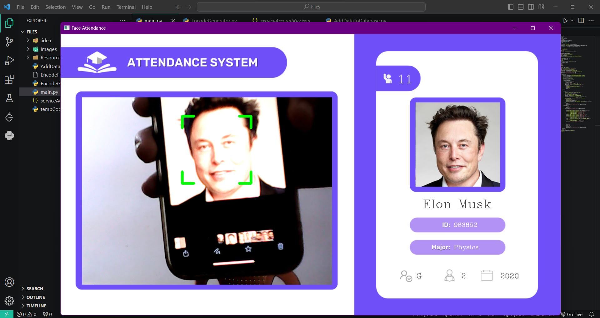
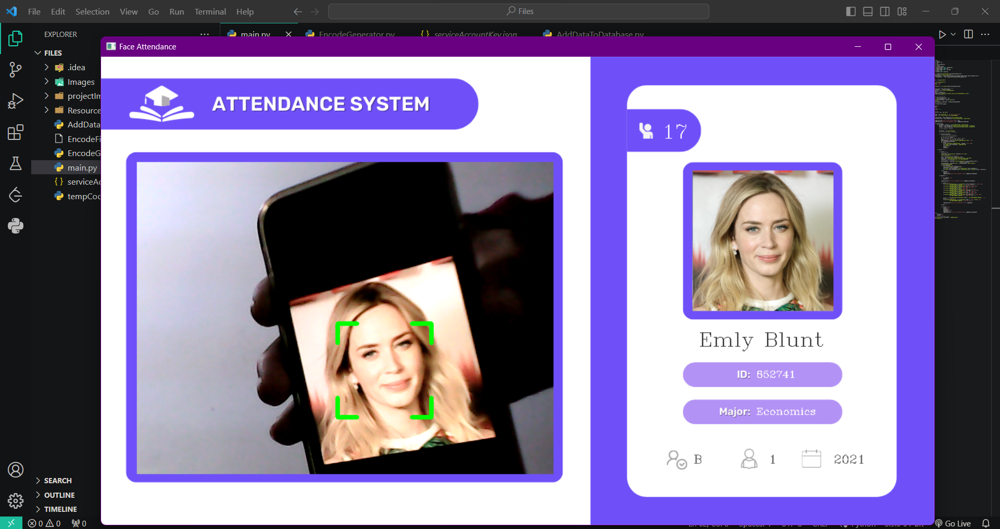

# Face Recognition Attendance System
<br>
<div align="center">
  
  
  
</div>
<br>
This is a Face Recognition Attendance System developed using OpenCV. The system recognizes faces in images or video streams and records attendance based on recognized faces.

## Features

- Face detection and recognition using OpenCV.
- Attendance recording with date and time.
- Configurable recognition thresholds.
- User-friendly command-line interface.
- Support for both image and video input.

## Prerequisites

Before running the system, ensure you have the following installed:

- Python (>=3.6)
- OpenCV (cv2)
- NumPy
- firebase-admin

You can install the required packages using pip:

```bash
pip install opencv-python numpy
